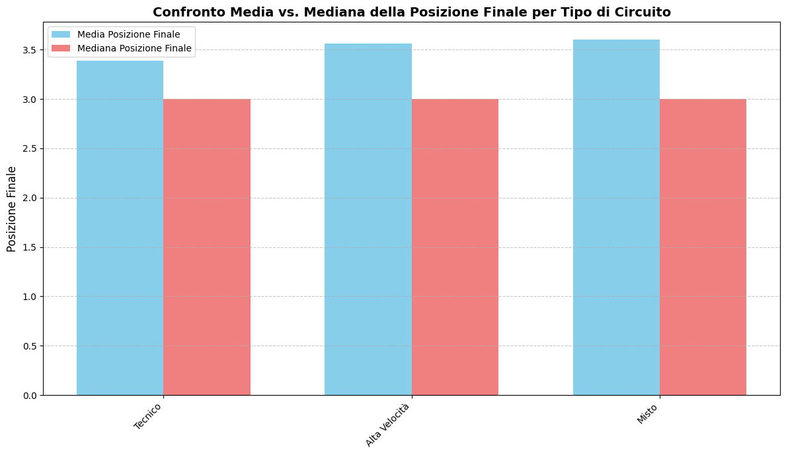
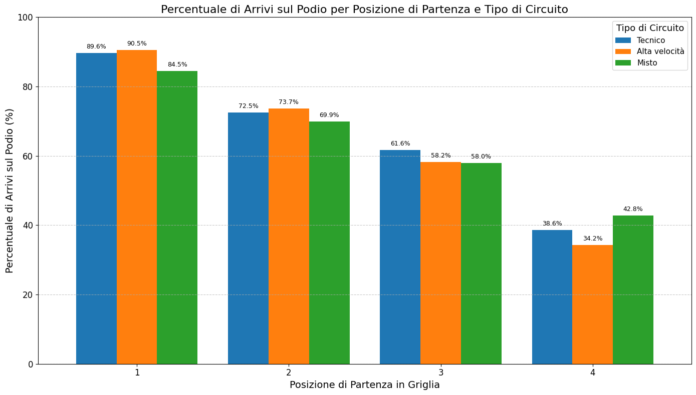
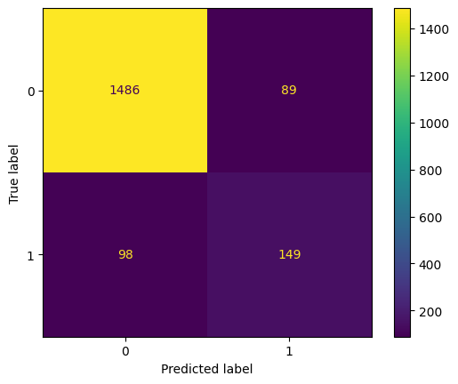

# IDS Project: Analysis of the Qualifying-Race Correlation in Formula 1 and the Impact of Circuit Type

**Author:** Nicolò Calandra

## 1. Introduction

This project delves into the analysis of historical Formula 1 data (from 1950 to 2024) with the main objective of studying the **correlation between the position obtained by drivers in qualifying and their final placement in the race**. A crucial focus of the analysis is to determine how this correlation is modulated by the **type of circuit**.

Through data exploration, statistical tests, and the development of a logistic regression model, we aim to understand if and how the intrinsic characteristics of a track (classified as Technical, High-Speed, or Mixed) influence the strategic importance of the starting position on the competition's outcome.

## 2. Defined Circuit Types

To conduct a targeted analysis, Formula 1 circuits have been classified into three main categories, based on their predominant characteristics:

1.  **Technical Circuit:** Characterized by a high number of corners and low-speed sections, where the driver's skill and the car's agility are determining factors.
2.  **High-Speed Circuit:** Tracks with long straights and few challenging corners, where engine power and aerodynamic efficiency play a major role.
3.  **Mixed Circuit:** Circuits that offer a balanced combination of technical sections and high-speed straights, requiring a compromise in the car's setup and versatility from the driver.

*(The specific classification used in the project is documented in the enriched `f1db-circuits.csv` file).*

## 3. Dataset Used

The analysis is based on the **F1DB** dataset, a comprehensive collection of historical Formula 1 information. The raw CSV data used for this study are located in the `f1db-csv/` folder and include:

*   `f1db-circuits.csv`: Detailed information about the circuits. **This file has been enriched by us** with a `track_type` column containing the circuit classification (Technical, High-Speed, Mixed) according to the definitions above.
*   `f1db-races.csv`: General details about each race held.
*   `f1db-races-race-results.csv`: Final race results for each driver, including starting and finishing positions.
*   `f1db-races-driver-standings.csv`: Overall driver standings updated before each race, used to derive a feature representing the driver's "form" or historical performance.

## 4. Project Structure

```
Formula-1-analysis/
├── f1db-csv/                 # Folder containing the dataset's CSV files
│   ├── f1db-circuits.csv
│   ├── f1db-races.csv
│   ├── f1db-races-race-results.csv
│   ├── f1db-races-driver-standings.csv
│   ├── test-tecnico.csv          # CSV file to test the model on technical circuits (example)
│   ├── test-alta-velocita.csv    # CSV file to test the model on high-speed circuits (example)
│   └── test-misto.csv            # CSV file to test the model on mixed circuits (example)
├── images/                   # Folder containing generated images
├── README.md                 # This file
└── progetto.ipynb            # Jupyter Notebook with the complete analysis

```

## 5. Requirements and Installation

To run the analysis contained in the `progetto.ipynb` notebook, you need Python 3.x and the following libraries installed:

*   `pandas` (for data manipulation)
*   `numpy` (for numerical calculations)
*   `matplotlib` (for creating plots)
*   `seaborn` (for advanced statistical visualizations)
*   `scipy` (for statistical tests)
*   `scikit-learn` (for the machine learning model)
*   `jupyter` (to run the notebook)

You can install all the necessary dependencies using `pip` and the (to be created) `requirements.txt` file:

```bash
pip install -r requirements.txt
```

Alternatively, individually:

```bash
pip install pandas numpy matplotlib seaborn scipy scikit-learn jupyter
```

## 6. How to Run the Analysis

1.  **Clone the Repository:**
    ```bash
    # Example: git clone https://github.com/your-username/Formula-1-analysis.git
    # cd Formula-1-analysis
    ```
2.  **Verify the Dataset:** Ensure the `f1db-csv/` folder with its CSV files is present in the main project directory.
3.  **Install Dependencies:** Follow the instructions in the "Requirements and Installation" section.
4.  **Start Jupyter:** Open and run the `progetto.ipynb` notebook via Jupyter Notebook or Jupyter Lab:
    ```bash
    jupyter notebook progetto.ipynb
    ```
    or
    ```bash
    jupyter lab progetto.ipynb
    ```
    Run the notebook cells in sequence.

## 7. Analysis Summary and Key Results

The `progetto.ipynb` notebook documents the entire analytical process, from data preparation to modeling. Below is a summary of the main steps and findings.

### 7.1. Data Preparation and Cleaning
*   Loading the various CSVs and merging them into a main analytical dataframe (`df`).
*   Handling missing values and converting data types.
*   Creating additional features, such as `podio` (binary target variable) and `classifica_pre_gara_rank` (pre-race standings rank).
*   Filtering data to include only races from the year 2000 onwards, to focus on more modern and consistent eras of F1.

### 7.2. Exploratory Data Analysis (EDA)

The EDA focused on understanding the distributions and relationships between key variables, segmented by circuit type.

*   **Distribution of Final Positions:**
    *   Histograms and box plots were generated to visualize the distribution of drivers' final positions.
    *   **[Placeholder for Graph: Histogram/Box Plot of Final Positions by Circuit Type]**
        *   *Comment*: These graphs revealed that [brief description of what is observed, e.g., Technical circuits show a slightly better median final position for drivers starting at the front, or less dispersion in results].
*   **Comparison of Mean vs. Median of Final Position:**
    *   The analysis of the difference between the mean and median of the final position indicated the presence of skewness and potential outliers, with more marked differences for High-Speed and Mixed circuits, suggesting greater dispersion towards higher (worse) finishing positions in these contexts.
    

*   **"OLAP Style" Analysis - Podium Finishes:**
    *   The percentage of podium finishes based on starting position and circuit type was examined.
    
    *Comment*: This analysis highlighted how, for example, on Technical circuits, starting in the very first rows seems to offer a more marked advantage for reaching the podium compared to High-Speed circuits.

### 7.3. Statistical Tests
*   T-tests (or equivalent non-parametric tests, if assumptions were not met) were performed to statistically compare the means of final positions between different starting positions (e.g., P1 vs P2, P2 vs P3) within each circuit category.
*   *Key Result*: These tests generally confirmed that starting further ahead is associated with a significantly better average final position. The magnitude of this difference, however, shows variations depending on the circuit type.

### 7.4. Logistic Regression Model

A logistic regression model was developed to predict the probability of a driver finishing the race **on the podium** (`podio = 1`).

*   **Selected Features:**
    *   `posizione_partenza` (numeric)
    *   `classifica_pre_gara_rank` (numeric, used as a proxy for the driver's "form" and historical skill)
    *   Circuit type (categorical, handled via one-hot encoding: `circuito_Tecnico`, `circuito_Alta_velocita`, `circuito_Misto`).
*   **Target Variable:** `podio` (binary: 1 if the driver finished in the top three, 0 otherwise).
*   **Model Evaluation:**
    *   The dataset was split into a training set and a test set.
    *   The model's performance was evaluated using appropriate classification metrics:
        *   **Accuracy:** 0.897 (compared to the accuracy of a null model).
        *   **Confusion Matrix:**
            
        *   **Precision:** 0.603
        *   **Recall:** 0.626
        *   **F1-Score:** 0.614
    *   *Comment*: The model demonstrated good predictive ability, outperforming the null model.
*   **Testing on New Data:** The trained model was used to make predictions on specially created test datasets (`test-tecnico.csv`, `test-alta-velocita.csv`, `test-misto.csv`), simulating real race scenarios and evaluating the consistency of the predictions with qualitative expectations.

## 8. Main Conclusions

The analysis conducted and the results of the logistic regression model suggest that:

1.  The **starting position is a statistically significant** and crucial factor in determining the final position and the probability of reaching the podium in Formula 1.
2.  The **relative importance of the starting position varies appreciably with the type of circuit**: on technical tracks, an excellent qualifying seems to translate into a more consolidated advantage compared to high-speed circuits, where other factors can shuffle the order more.
3.  The **historical performance and "form" of the driver** (approximated by their pre-race classification) constitute another relevant predictor for success in the race.
4.  The logistic regression model, although simple, proved capable of capturing these dynamics and providing **useful predictions**, serving as a solid baseline for any more complex models.

## 9. Possible Future Developments

*   **New Feature Engineering:** Explore adding variables such as weather conditions, specific team/engine reliability in that season, and driver experience on the specific circuit.
*   **Alternative Models:** Test more advanced machine learning algorithms (e.g., Random Forest, Gradient Boosting, Neural Networks) to assess if they can offer an increase in predictive performance.
*   **More Granular Temporal Analysis:** Study how correlations have changed across different regulatory eras within the post-2000 period.
*   **Specific Segment Analysis:** Deepen the analysis for specific groups of drivers (e.g., top teams vs. midfield) or for specific finishing positions beyond the podium.
*   **Simplified Deployment:** Create a small web application (e.g., with Streamlit or Flask) to interact with the model and make predictions on hypothetical races.
